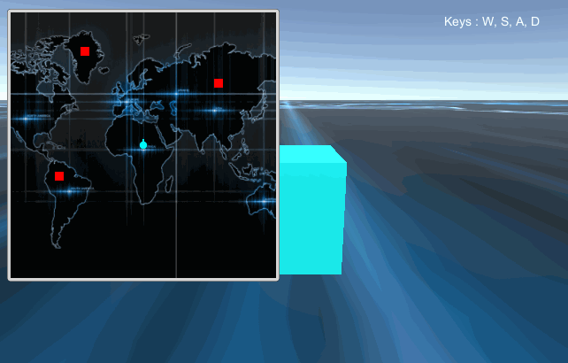

# MGS-UIMap
- [中文手册](./README_ZH.md)

## Summary
- Unity plugin for make mini map and draw motion trail in scene UI.

## Environment
- Unity 5.0 or above.
- .Net Framework 3.5 or above.

## Achieve
- Global map UI.
- Local map UI.
- Flag on map.
- Draw trail of dynamic flag on map.

## Demo
- Demos in the path "MGS-UIMap/Scenes" provide reference to you.

## Preview
- Global Map Trail

## Contact
- If you have any questions, feel free to contact me at mogoson@outlook.com.